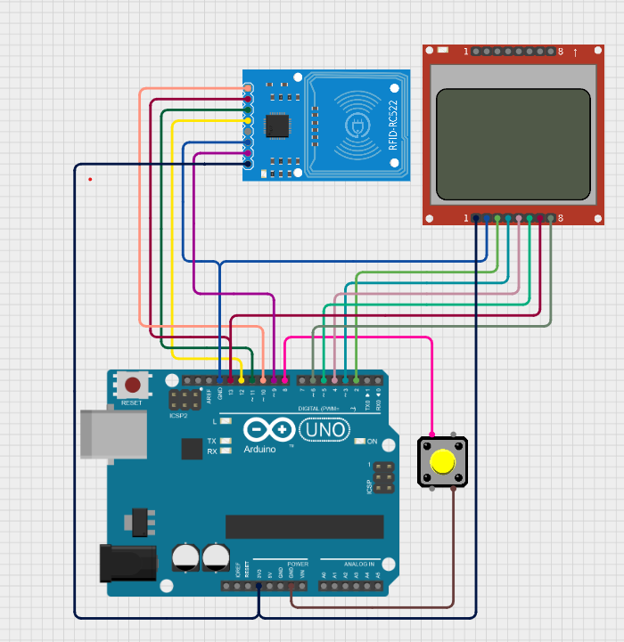

# RFIDCloner.io

This project is an Arduino-based solution designed for cloning and interacting with RFID tags. It provides a comprehensive guide to building and programming an RFID cloning device using Arduino hardware and software.

## Features

- Supports reading and writing RFID tags.
- Fully compatible with RFID MFRC522 modules and Nokia 5110 LCD displays.

## Demo

[Watch the demo video](https://www.tiktok.com/@bloaon/video/7495078987660659975?is_from_webapp=1&sender_device=pc&web_id=7501624603162428944)



## Requirements

- Arduino board (e.g., Uno, Mega, Nano).
- RFID module (e.g., MFRC522).
- Nokia 5110 LCD display.
- Button.
- USB cable for programming.
- Arduino IDE installed on your computer.

## Installation

1. Connect each component as shown in the diagram above.
2. Clone the repository:
    ```bash
    git clone https://github.com/yourusername/RFIDCloner.io.git
    cd RFIDCloner.io
    ```
3. Open the `.ino` file in the Arduino IDE.
4. Connect your Arduino board to your computer.
5. Upload the code to the Arduino board.
